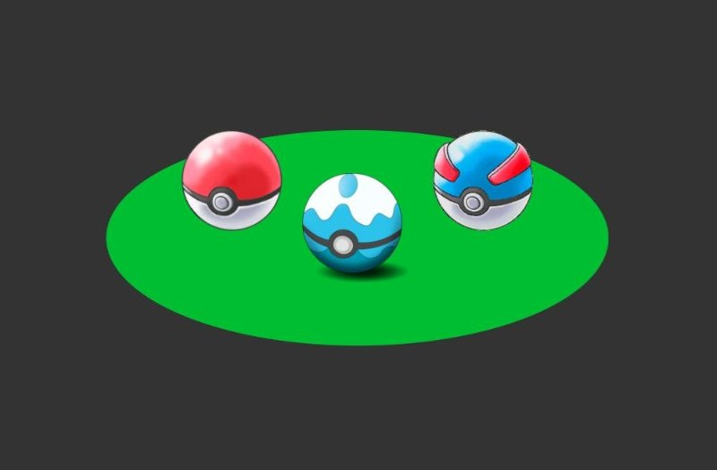
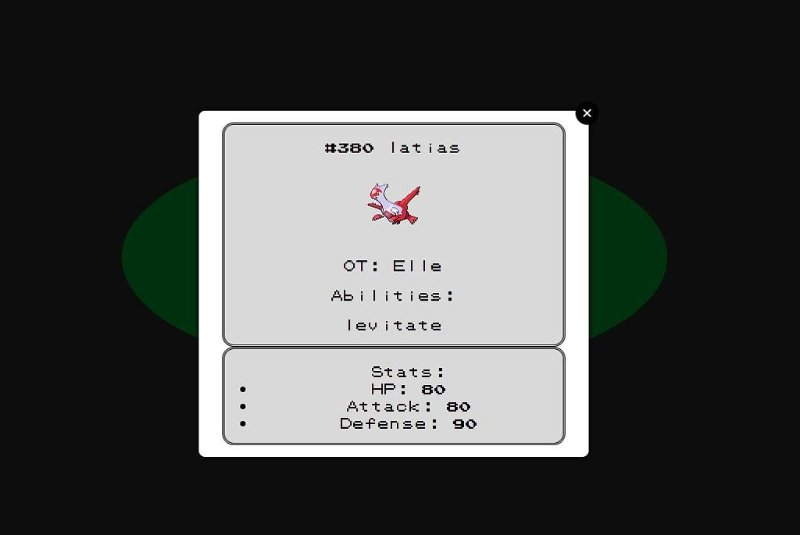

# Personal-Pokedex

## Goal
To create a pokemon trainer showcase website that displays information focused around 3 pokemon chosen by the student using AJAX to retrieve said data. This project is focused on client side technologies.

## Summary
Styling inspired by Pokémon core game series--layout designed to look like starter Pokémon selection screen while modal styling is reminiscent of in-game Pokédex entries from border to font to color choice. 

## Deployment
Deployed to Git Pages at ngolilli94.github.io

## Built Using
* VSCode
* Koala (SCSS Compiler)
* Github
* PokeAPI
* kylefox jQuery Modal (Library)
* Superpencil pokemon-font (Github)
* W3Schools (for image hover overlay effect tutorial)
* John's knowledge :) 
* David's instructing ^^
