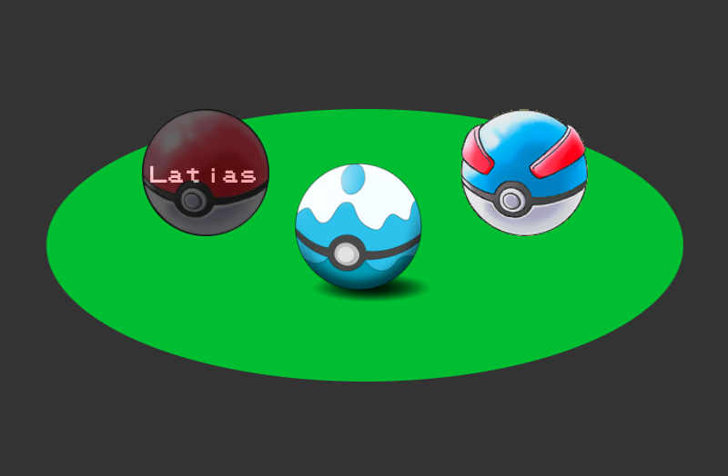

# Personal Pokedex

## Goal
To create a pokemon trainer showcase website that displays information focused around 3 pokemon chosen by the student using AJAX to retrieve said data. This project is focused on client side technologies.

## Summary
Styling inspired by Pokémon core game series--layout designed to look like starter Pokémon selection screen while modal styling is reminiscent of in-game Pokédex entries from border to font to color choice. 

## Deployment
Deployed to Heroku at https://elle-poketeam.herokuapp.com/index.html

## Built Using
* PokeAPI (https://github.com/PokeAPI/pokeapi)
* kylefox jQuery Modal (http://jquerymodal.com/)
* Superpencil pokemon-font (https://github.com/Superpencil/pokemon-font)
* W3Schools image hover overlay effect tutorial (https://www.w3schools.com/howto/howto_css_image_overlay.asp)
